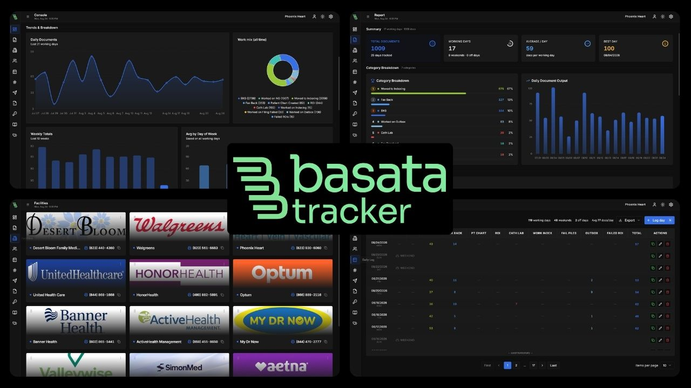

<div align="center">


## Basata Tracker

**A fast, focused productivity tracker for AR associates** — log and analyze your daily document workflow with per-user data isolation, cross-device sync, and an append-only audit trail.

[](https://react.dev)
[](https://www.typescriptlang.org)
[](https://vitejs.dev)
[](https://supabase.com)
[](https://vitest.dev)



</div>

---

## Why not a spreadsheet?

|  | Basata Tracker |
|---|---|
| **Immutable audit trail** | Every log save, category change, and account deletion lands in an append-only table — record-keeping requirements are satisfied by design, not by discipline |
| **Cross-device live sync** | Start tap-counting on one workstation, pick up mid-session on another — server state is always the source of truth |

Built for shift-based AR work: multi-step fax/indexable tracking, custom categories, day-of-week analytics, and a 10-hour session cap that fits real schedules.

---

## Features

| Feature | Description |
|---|---|
| **Console** | Industrial workflow console — per-category totals, trend charts, weekly breakdowns, day-of-week averages, contribution heatmap |
| **Daily Log** | Full history with search, pagination, inline edit/delete, CSV/JSON export |
| **Counter** | Tap-to-count interface with auto-save and live sync across devices |
| **Date Range Report** | Preset or custom range filters with summary stats and category breakdown |
| **Users** | Directory of registered users with profile and sign-in details |
| **Settings** | Custom categories (add, edit, reorder, delete), profile updates, password change, account deletion |
| **Credential Vault** | Encrypted-at-rest credentials organized in folders, with service favicon lookup |
| **Auth** | Email/password sign-up via Supabase; every record scoped to its owner |

---

## Tech Stack

| Layer | Technology |
|---|---|
| Frontend | React 18 · TypeScript · Vite 5 |
| UI | shadcn/ui · Tailwind CSS · Lucide icons |
| Charts | Recharts |
| Backend / DB | Supabase — Postgres, Auth, Row Level Security, Edge Functions (Deno) |
| Server state | TanStack React Query |
| Validation | Zod (every mutation and query response) |
| Routing | React Router v6 |
| Testing | Vitest · Testing Library · jsdom |

---

## Getting Started

### Prerequisites

- [Node.js 18+](https://nodejs.org) and npm
- A [Supabase](https://supabase.com) project
- [Supabase CLI](https://supabase.com/docs/guides/cli) — to apply migrations

### 1 · Clone and install

```bash
git clone https://github.com/HumayunK01/BasataTracker.git
cd BasataTracker
npm install
```

### 2 · Configure environment

```bash
cp .env.example .env.local
```

```env
# .env.local — never commit this file (it is gitignored)
VITE_SUPABASE_URL=https://your-project.supabase.co
VITE_SUPABASE_PUBLISHABLE_KEY=your_anon_publishable_key
```

> The **service role key** is never used by the frontend. It is read only by
> Edge Functions via `Deno.env.get("SUPABASE_SERVICE_ROLE_KEY")` and must be
> configured as a Supabase Function secret — not in any `.env` file.

### 3 · Apply the database schema

Schema lives in `supabase/migrations/` — do **not** hand-write tables:

```bash
supabase link --project-ref <your-project-ref>
supabase db push
```

This creates `daily_logs`, `categories`, `audit_logs`, and `profiles`, all with Row Level Security policies, plus the `delete_own_account()` function and the new-user profile trigger.

### 4 · Run locally

```bash
npm run dev
```

Open **http://localhost:8080**.

---

## Scripts

```bash
npm run dev         # Start dev server (port 8080)
npm run build       # Production build
npm run build:dev   # Development-mode build
npm run preview     # Preview the production build
npm run lint        # Run ESLint
npm run test        # Run the test suite once (Vitest)
npm run test:watch  # Run tests in watch mode
```

---

<details>
<summary><strong>Project Structure</strong></summary>

```
src/
├── components/
│   ├── ar/            # App-specific components (Sidebar, Charts, Table, Heatmap, …)
│   └── ui/            # shadcn/ui primitives (only those in use)
├── hooks/             # Data & logic hooks
│   ├── useAuth.ts                # Session, expiry checks, refresh
│   ├── useDailyLogs.ts           # Log CRUD + Zod validation + rate limit
│   ├── useCategories.ts          # Category CRUD + Zod validation
│   ├── useDailyActivity.ts       # Team activity via Edge Function
│   ├── useProfile.ts             # Profile read/update
│   ├── useAuditLog.ts            # Append-only audit events
│   └── useMutationRateLimit.ts   # Client-side sliding-window limiter
├── integrations/supabase/   # Supabase client + generated DB types
├── lib/               # Utilities (CSV/JSON export, category colors)
├── pages/             # Route pages
├── types/             # Shared types and date/format helpers
└── test/              # Vitest suites (incl. security verification)

api/                   # Vercel serverless functions — same-origin image proxies
├── favicon.js         # Favicon proxy (SSRF-hardened)
└── logo.js            # Facility logo proxy

supabase/
└── migrations/        # Source of truth for the database schema
```

</details>

<details>
<summary><strong>Data Model</strong></summary>

All tables enable Postgres **Row Level Security**; every policy is scoped to `auth.uid()`, so a user can only ever read or write their own rows.

| Table | Purpose |
|---|---|
| **`daily_logs`** | One row per user per day. Category counts in a single `counts` JSONB column, plus `is_off_day` and `notes` |
| **`categories`** | Per-user ordered list of document categories — drives counters, charts, and forms dynamically |
| **`fax_tracker` / `indexable_tracker`** | Per-patient multi-step document status |
| **`credentials` / `credential_folders`** | Credential vault with folder organization |
| **`audit_logs`** | Append-only record of sensitive actions — no update/delete policies, entries are immutable |
| **`profiles`** | First/last name per user, auto-created on signup via a trigger |

A `SECURITY DEFINER` function, `delete_own_account()`, lets a user delete only their own auth account (revoked from `PUBLIC`, granted to `authenticated`).

</details>

<details>
<summary><strong>Security</strong></summary>

- **Input validation** — every mutation and query response is parsed with Zod schemas before touching the database or UI
- **Rate limiting** — sliding-window limiter guards mutations; login caps attempts (5 / 60s). Authoritative limits enforced by Supabase Auth and RLS server-side
- **Headers** — CSP, HSTS, `X-Frame-Options`, `X-Content-Type-Options`, `Referrer-Policy`, `Permissions-Policy` set in `vite.config.ts` (dev) and `vercel.json` (prod)
- **Secrets** — only the public anon key reaches the client; service role key confined to Edge Functions
- **Audit trail** — sensitive actions recorded in an append-only table

A regression suite (`src/test/security-claims.test.ts`) empirically verifies the input-validation and rate-limit behavior.

</details>

---

## Deployment

Static SPA — `vercel.json` rewrites all routes to `index.html` for client-side routing.

```bash
npm run build      # outputs to dist/
```

Deploy `dist/` to any static host (Vercel, Netlify, Cloudflare Pages). Set `VITE_SUPABASE_URL` and `VITE_SUPABASE_PUBLISHABLE_KEY` as build-time environment variables in your host's dashboard.

---

<div align="center">

**Basata Tracker** · Built with care for AR teams

</div>
